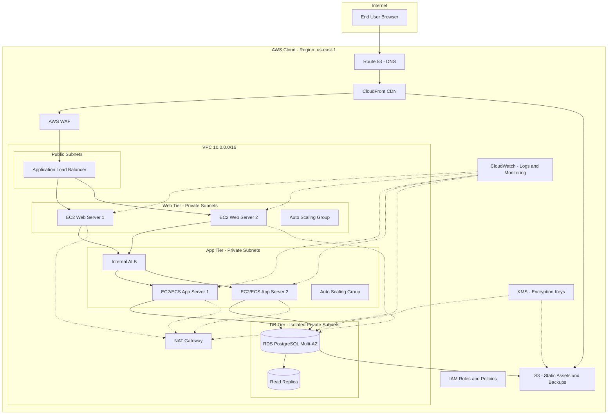

# Architecture — ShopEase 3-Tier Web Application

## Diagram

## Tier Breakdown

### 1. Web Tier
- **Components:** CloudFront (CDN), AWS WAF, Application Load Balancer, EC2 Auto Scaling Group running Nginx
- **Placement:** Load balancer in public subnets; web servers in private subnets (not directly internet-facing)
- **Purpose:** Serves static content, TLS termination, request routing, DDoS/edge protection

### 2. Application Tier
- **Components:** Internal ALB, EC2 Auto Scaling Group (or ECS Fargate) running the application logic (Node.js/Java/Python API)
- **Placement:** Private subnets, only reachable from the web tier
- **Purpose:** Business logic, session handling, API endpoints, calls to database tier

### 3. Database Tier
- **Components:** Amazon RDS for PostgreSQL, Multi-AZ deployment with a read replica
- **Placement:** Isolated private subnets, no direct route to/from the internet
- **Purpose:** Persistent data storage (orders, users, inventory)

### Supporting Services
| Service | Role |
|---|---|
| Route 53 | DNS management |
| CloudFront | Content delivery, edge caching |
| AWS WAF | Layer 7 filtering (SQLi, XSS rules) |
| S3 | Static assets, log storage, DB backups |
| KMS | Encryption key management (EBS, RDS, S3) |
| CloudWatch | Logging, metrics, alarms |
| IAM | Identity, roles, least-privilege policies |
| NAT Gateway | Outbound internet access for private subnets |

## Network Segmentation
- **Public subnets:** ALB only
- **Private subnets (web/app):** No public IPs; traffic only via load balancers
- **Isolated subnets (DB):** No route to NAT/Internet Gateway at all

This segmentation is central to the responsibility matrix — the more AWS manages (e.g., RDS engine), the less the customer is responsible for at that layer, but network/access control design is always the customer's job.
